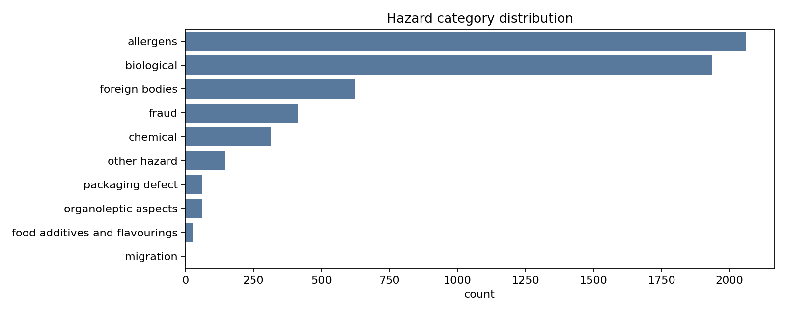
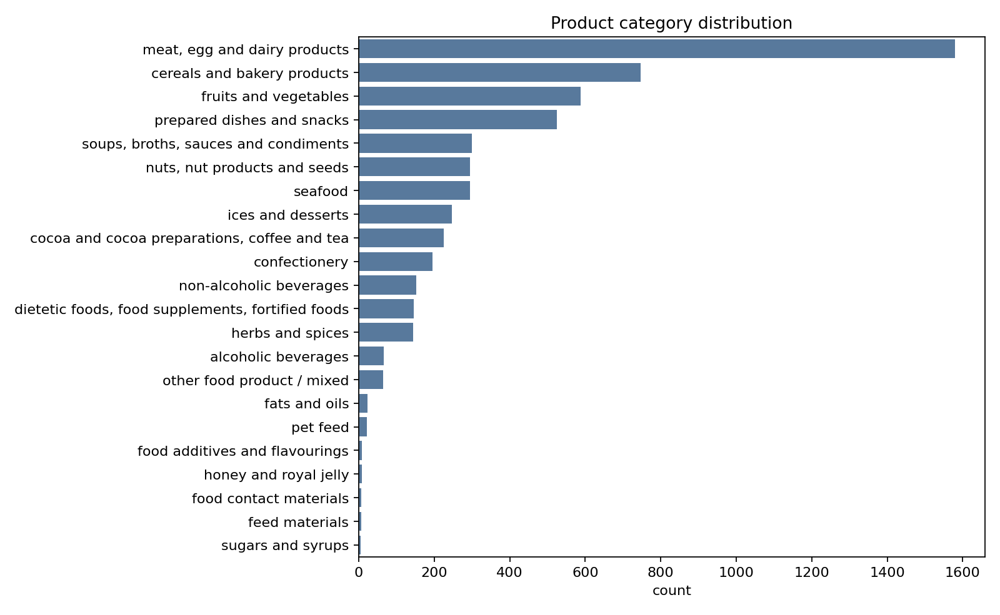
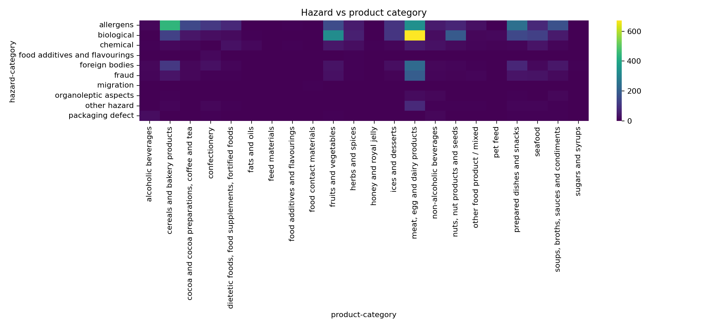
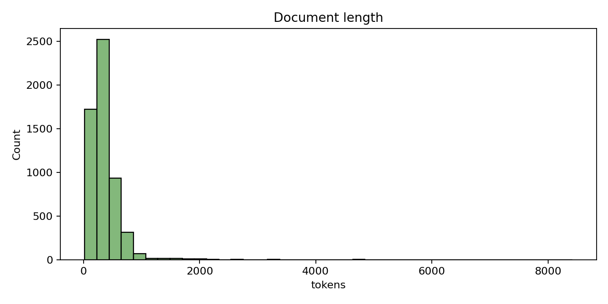
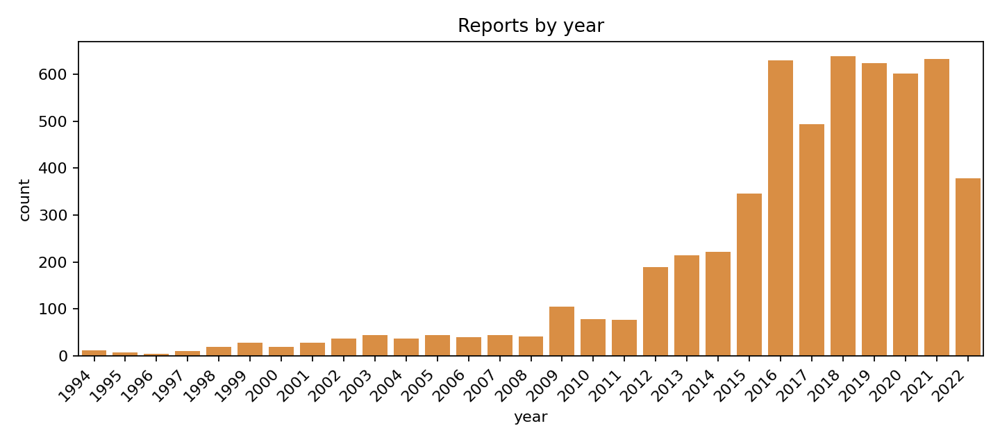

# Efialtis Stin Kouzina

Food Hazard Detection, SemEval-2025 Task 9, Subtask 1 (ST1). Project for the NLP course, CSE UOI 2026. Athanasios Fourkiotis, student ID 4940.

## What the assignment asks

For every food recall we want to predict two labels from the text, the hazard category (10 classes) and the product category (22 classes). The task runs as a Kaggle challenge: you train on about 5 thousand labelled recalls, submit predictions for about a thousand unseen ones, and you're scored with the official ST1 metric. The course also wants proper data analysis, a documented history of what you tried including the failures, and a report.

The metric is what makes it interesting. The score is the average of the hazard macro F1 and the product macro F1 computed only on the rows where the hazard was predicted correctly. So if the hazard comes out wrong, getting the product right doesn't count for that example. And since the classes are heavily imbalanced and macro F1 gives the rare ones equal weight, the long tail is where the points are won and lost.

## The name

Efialtis Stin Kouzina is Greek for Kitchen Nightmare. The system finds the nightmares hiding in food recalls, allergens, contaminations, foreign bodies, before they reach the plate.

## How I solved it

The key observation is that the metric couples the two labels, so instead of two independent classifiers I predict the hazard first and feed that prediction into the product model as a feature. To stop the product from learning to blindly trust a too-perfect hazard signal, the training set gets out-of-fold hazard predictions, meaning every row is predicted by a model that never saw it. That gives the product a realistic signal of about 94% accuracy, the same thing it will face at test time.

Concretely, the pipeline starts with TF-IDF over title plus text plus metadata, using word 1-2 grams together with character 3-5 grams, and the metadata like country, year and month go in as plain text tokens. On top of that come MiniLM sentence embeddings, 384 dimensions, L2 normalized, stacked onto the TF-IDF scaled by 0.7. That scale came out of a sweep and behaves like a U, since too much or too little hurts, the embeddings should contribute without drowning the 160 thousand sparse features. A LinearSVC learns the hazard on this stacked space, the out-of-fold hazard goes in as a one-hot feature, and a second LinearSVC learns the product on the final space. The submission that ended up best is a stacking ensemble of the TF-IDF family and the MiniLM family, with the mixing weights picked through cross-validation.

## What came out

The plain TF-IDF with LinearSVC baseline scored 0.7599 on validation. Adding the out-of-fold hazard feature moved it to 0.7623, which gave 0.7573 on the Kaggle public board. Adding the MiniLM embeddings reached 0.7737 locally but actually dropped to 0.7512 on Kaggle, which was the first warning that the single validation split was lying to me. The stacking ensemble finished at 0.7775 on Kaggle, my best public score.

The big lesson of the project is exactly that: the single validation split of 565 samples was unreliable. Under proper 5-fold cross-validation the ST1 came out 0.7036 plus or minus 0.0516, so any improvement smaller than about 0.05 was just noise. Only the stacking survived both the cross-validation and Kaggle. I also fine-tuned DistilBERT, and on the single split it looked spectacular, but on this small dataset with macro F1 the classic TF-IDF plus LinearSVC with balanced class weights proved better, so the neural models stayed as a documented baseline.

## Data analysis

The categories are strongly imbalanced, a few classes like allergens and biological hold most of the examples while several have barely any, which is what makes macro F1 hard.





The hazard and product relationship is not one-to-one, the same hazard shows up in lots of products and the other way around, so both the text and the hazard signal are needed.



The documents vary a lot in length, which is why the character n-grams help, and the distribution per year is not uniform either.





## Where things are

The code folder has the whole pipeline, notebooks 01 to 12 going from EDA through the classical models to the embeddings, the cross-validation and the stacking, plus the helper modules in src, the tests and main.py. The raw data sits in data/raw and the report and presentation are at the top level. Detailed run instructions and the full experiment history, including everything that did not work, live in [code/README.md](code/README.md) and in report.pdf.

For a quick run:

```powershell
cd code
pip install -r requirements.txt
python main.py
```

That produces the final submission_stacking.csv.

## Data

The data comes from SemEval-2025 Task 9, the Food Recall Incidents dataset (CC BY-NC-SA 4.0), and is used for educational purposes only.
